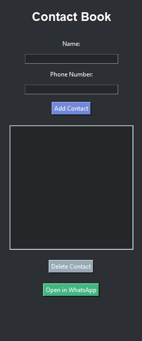

Sure, here's the updated `README.md` with a section for output:

```markdown
# BuddyBook

BuddyBook is a simple and intuitive contact book application created using Python and the Tkinter library. It allows users to add, delete, and manage contacts, as well as open WhatsApp directly to message a selected contact.

## Features

- Add new contacts with name and phone number.
- Delete existing contacts.
- Open WhatsApp to message a selected contact instantly.
- User-friendly GUI with Tkinter.

## Getting Started

### Prerequisites

- Python 3.x
- Tkinter library
- pywhatkit library

### Installation

1. Clone the repository or download the source code.

```bash
git clone https://github.com/iamproprogramr/Buddybook.git
```

2. Install the required libraries.

```bash
pip install pywhatkit
```

### Running the Program

Run the `buddybook.py` file to start the application.

```bash
python buddybook.py
```

## Usage

1. **Add Contact**: Enter the name and phone number in the respective fields and click the "Add Contact" button.
2. **Delete Contact**: Select a contact from the list and click the "Delete Contact" button.
3. **Open in WhatsApp**: Select a contact from the list and click the "Open in WhatsApp" button to open WhatsApp and message the contact instantly.

## Code Overview

The main components of the code include:

- **add()**: Adds a new contact to the contact list.
- **delete()**: Deletes the selected contact from the contact list.
- **open_whatsapp()**: Opens WhatsApp to message the selected contact instantly.
- **update_contact()**: Updates the contact list displayed in the GUI.

## Output

Here's what the application looks like:



When you run the program, you'll see a window like this:

- **Add Contact**: Use the input fields to add a new contact. The contact will appear in the list below.
- **Delete Contact**: Select a contact from the list and delete it.
- **Open in WhatsApp**: Select a contact and open WhatsApp to send a message directly.

## Contact

This program is written by Muhammad Yousaf. For any queries, you can reach out to me at [yousafsahiwal3@gmail.com](mailto:yousafsahiwal3@gmail.com).

## License

This project is licensed under the MIT License.
```
